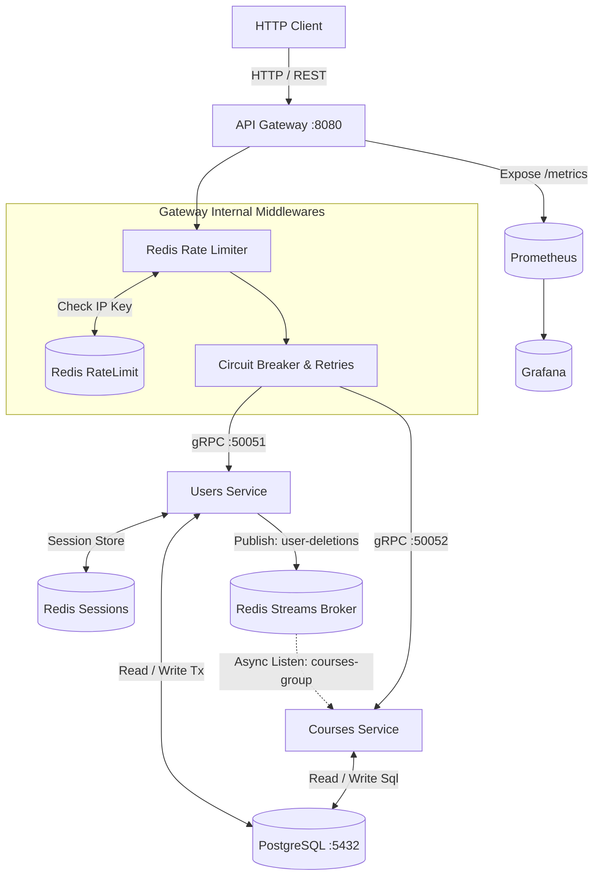

# 🚀 Gourses — Microservices Platform for Course Management

<p align="center">
  <a href="https://go.dev"></a>
  
  
  
  
  
  
  
  <a href="https://opensource.org/licenses/MIT"></a>
</p>

**Gourses** is a production-ready microservices platform written in Go, specifically designed to model enterprise backend design patterns, secure hybrid authentication, high-availability networking, and distributed eventual consistency.

The system features an HTTP API Gateway acting as a reverse proxy/router for multiple downstream gRPC core microservices. It utilizes a three-tier localized architecture with independent Redis nodes serving dedicated infrastructure responsibilities (Session Management, Rate Limiting, and a Message Broker via Redis Streams).

---

## 🏗 Microservice Architecture

The platform splits bounded contexts into separate isolation domains communicating via ultra-fast, payload-compressed gRPC protocols internally, and publishing events via an asynchronous broker.

* **API Gateway (`gateway`)**: The unified public entry point. Manages strict request throttling, validation, Prometheus monitoring instrumentation, failure handling via custom Circuit Breakers, and stateless/stateful authorization middleware overlays.
* **Users Microservice (`users`)**: Handles user identity lifecycle, secure cryptographic persistence parameters, and stateful session caching.
* **Courses Microservice (`courses`)**: Controls course listings, internal permissions management, and acts as a reactive event consumer to ensure referential and database integrity across isolated storages.

### Network Topology & Data Flow



---

## ✨ Key Technical Features

### 1. Hybrid Auth Overlay (JWT + Server-Side Sessions)

* **Stateless Layer**: Validates standard `Authorization: Bearer <token>` tokens containing identity metadata claims (`user_id`, `user_role`).
* **Stateful Resiliency**: In the event of an expired or unverified signature token, the gateway fallback engine interrogates a secure, cryptographically generated stateful `session_key` token embedded inside the user's incoming `HttpOnly` Cookie.
* **Automatic Handshake Session Sync**: The gateway calls the `ValidateUser` gRPC endpoint to verify session mapping stored inside a dedicated Redis instance (`redis_sk`). If valid, the session token and JWT are renewed transparently without user interaction.

### 2. High-Availability & Fault Tolerance Patterns

* **Multi-Instance Redis Tiering**: Three physically isolated, password-secured Alpine Redis instances are deployed to completely segregate data structures and eliminate single-point contention bottlenecks:
* `redis_sk`: Exclusive database for stateful user sessions validation.
* `redis_rl`: Dedicated to high-speed atomic increments for the API Gateway Rate Limiter.
* `redis_bk`: Operates as a persistent message broker storing transactional execution logs.


* **Circuit Breaker & Transient Retry Fabric**: All network pipelines traversing downstream gRPC clients are wrapped inside a `sony/gobreaker` mechanism. If a downstream microservice suffers 5 consecutive runtime failures, the circuit breaker trips into an `Open` state to shield infrastructure. For intermittent network blips, an exponential backoff retry loop attempts up to 5 automatic executions before failing.
* **Sliding Window Rate Limiter**: Middleware monitoring safeguards the entry gateway by binding client IPs (`rl:<ip>`) using an atomic Redis transaction scheme restricted to a maximum threshold of 50 requests per minute.

### 3. Asynchronous Messaging & Eventual Consistency

To maintain data integrity without tightly coupling microservices with synchronized transactional locks, an asynchronous event-driven system is established via **Redis Streams**:

* When a user account is deleted, the `users` service processes a hard database deletion inside a Postgres transaction, then immediately pushes an event packet containing the `user_id` to the `users-deletions` stream.
* The `courses` service runs a background listener daemon subscribing to the consumer group `courses-group` (`instance-1`). It continuously processes blocks, captures deletions, and wipes any orphaned content or resource records belonging to the deleted profile to prevent database bloat.

### 4. Enterprise Observability & Code Foundations

* **Prometheus Metric Collection**: Custom metrics tracking processing latencies (`seconds_per_operation`) via histogram buckets alongside request execution counters are exposed directly on the public Gateway endpoint (`/metrics`).
* **Graceful Shutdown Routing**: Custom lifecycle loops capture `SIGINT` and `SIGTERM` signals system-wide, smoothly draining active gRPC connections, flushing database pools safely, and terminating Redis background channels cleanly without abandoning ongoing processing tasks.

---

## 📖 API Endpoints Reference

### Public API Gateway (HTTP / REST Engine via Gin)

All gateway client routing functions run on public port `:8080` and pass through the Rate Limiter layer.

| Method | Endpoint | Auth Constraint | Payload Description |
| --- | --- | --- | --- |
| **POST** | `/api/users/reg` | None | User enrollment. Spawns entity and outputs authentication token signatures. |
| **POST** | `/api/users/log` | None | Verifies identities and mounts stateful HTTP session tracking components. |
| **PUT** | `/api/users/update` | Bearer Token + Cookie | Updates registration records. Restricted to verified session holders. |
| **POST** | `/api/courses/new` | Bearer Token + Cookie | Allocates a new course record. Inherits active owner contextual metadata. |
| **GET** | `/api/courses/get/:course_id` | Bearer Token + Cookie | Resolves specific course information data sheets. |
| **PUT** | `/api/courses/update/:course_id` | Bearer Token + Cookie | Modifies course details. Validates role privileges (`admin`/`teacher`). |
| **DELETE** | `/api/courses/delete/:course_id` | Bearer Token + Cookie | Destroys specified course assets based on authorization permissions. |
| **GET** | `/metrics` | None | Exposes scraped metric monitoring logs natively for Prometheus. |

---

## 🛠 Testing & Integration Verification (`gurl-cli`)

End-to-end operational behaviors, pipeline execution, edge constraints, and verification flows are fully mapped via high-performance integration configuration profiles using custom `.gurlf` formatting.

You can execute testing trees across individual localized targets or execute an overarching system-wide validation sequence:

* **Execute System Core Integration Test Grid**:
```bash
gurl-cli check_all.gurlf

```
> Or run Target Specific Component Infrastructure Directly

---

## 🐳 Containerized Deployment

Production environment instances are fully simulated and linked via Docker Compose.

### Environment Variables (.env)

Create a `.env` configuration file in the project root directory before spinning up the infrastructure:

```env
POSTGRES_USER=gourses
POSTGRES_HOST=postgres
POSTGRES_PASSWORD=1234
POSTGRES_DB=gourses_db
POSTGRES_PORT=5432
POSTGRES_URL="postgres://${POSTGRES_USER}:${POSTGRES_PASSWORD}@${POSTGRES_HOST}:${POSTGRES_PORT}/${POSTGRES_DB}?sslmode=disable"

REDIS_SK_PORT=6378
REDIS_SK_HOST=redis_sk
REDIS_SK_PASSWORD=redis_sk_pass

REDIS_RL_PORT=6379
REDIS_RL_HOST=redis_rl
REDIS_RL_PASSWORD=redis_rl_pass

REDIS_BK_PORT=6380
REDIS_BK_HOST=redis_bk
REDIS_BK_PASSWORD=redis_bk_pass

REDIS_PORT=6379

API_PORT=8080

USERS_PORT=50051
USERS_HOST=users
COURSES_PORT=50052
COURSES_HOST=courses
JWT_SECRET=12345

PROMETHEUS_PORT=9090
GRAFANA_PORT=3000
GRAFANA_PASSWORD=admin

```

### Initializing the System

Launch all database instances, Redis nodes, monitoring utilities, and backend services with a single command:

```bash
docker compose up --build -d

```

*The Postgres instance will spin up and automatically source schema layouts (`1-users.sql` and `1-courses.sql`) inside the `/docker-entrypoint-initdb.d/` directory to construct index maps and baseline relation matrices.*

---

## 📜 Licenses & Dependency Attributions

**Gourses** is open-source software licensed under the terms of the [MIT License](https://www.google.com/search?q=LICENSE).

To ensure complete legal compliance and framework transparency, here is a detailed breakdown of core third-party open-source components, drivers, and frameworks compiled alongside this platform:

| Dependency / Module | License | Functional Utilization Area | Project Reference Link |
| --- | --- | --- | --- |
| **Gin Gonic** | MIT | Core HTTP Router engine driving the API Gateway web layer. | [gin-gonic/gin](https://github.com/gin-gonic/gin) |
| **gRPC-Go** | Apache-2.0 | Underlying high-performance RPC infrastructure for internal microservice communication. | [grpc/grpc-go](https://github.com/grpc/grpc-go) |
| **Go-Redis** | BSD-2-Clause | State-machine command client driver handling connections to our 3 isolated Redis environments. | [go-redis/redis](https://github.com/go-redis/redis) |
| **Sqlx** | MIT | General extension layer for Go standard database tools providing clean structured data scanning. | [jmoiron/sqlx](https://github.com/jmoiron/sqlx) |
| **Squirrel** | MIT | Fluid SQL generation builder used to produce dynamic queries safely inside internal database layers. | [Masterminds/squirrel](https://github.com/Masterminds/squirrel) |
| **Golang JWT** | MIT | Cryptographic token handling suite providing JSON Web Token structural validations. | [golang-jwt/jwt](https://github.com/golang-jwt/jwt) |
| **Go Breaker** | MIT | State-based implementation monitoring framework driving our Circuit Breaker architecture. | [sony/gobreaker](https://github.com/sony/gobreaker) |
| **Prometheus Client** | Apache-2.0 | Metric aggregation subsystem collection wrapper providing instrumentation hooks. | [prometheus/client_golang](https://github.com/prometheus/client_golang) |
| **Zap Logger** | MIT | Structured, blazingly fast atomic leveling diagnostics printing engine implemented globally. | [uber-go/zap](https://github.com/uber-go/zap) |
| **Go Playground Validator** | MIT | Comprehensive structurally mapped payload assertion validation engine interface. | [go-playground/validator](https://github.com/go-playground/validator) |
| **Bcrypt Crypto** | BSD-3-Clause | Strong, adaptive, salt-hashed identity secret validation components. | [golang/x/crypto](https://github.com/golang/crypto) |
| **Lib/PQ** | MIT | Pure Go connection driver designed for communications interfacing with PostgreSQL instances. | [lib/pq](https://github.com/lib/pq) |

  - **License:** This project is licensed under [MIT](LICENSE)
  - **Third-party Licenses:** Third-party [licenses/](licenses/).
